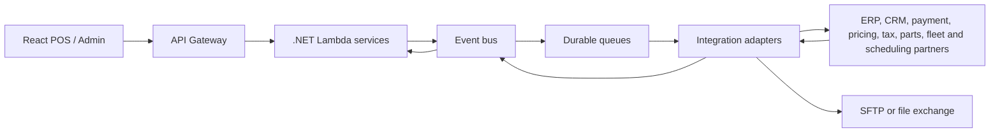

# Integration Architecture

## Integration principles

- Expose product capabilities through versioned APIs, not database access.
- Keep partner-specific mapping and authentication in an adapter owned by Integration or the relevant capability.
- Prefer events for notifications, propagation, and long-running work.
- Use synchronous APIs only when the caller needs an immediate business decision.
- Make every outbound operation retryable, observable, and idempotent.
- Treat external systems as unreliable: use timeouts, bounded retries, dead-letter handling, and replay tooling.

## Integration topology

## Contract categories

| Contract | Pattern | Examples |
| --- | --- | --- |
| User-facing command/query | REST over API Gateway | create order, search vehicle, book appointment, take payment |
| Internal service interaction | REST or event | obtain master data, publish order status |
| Domain event | Versioned event | `OrderCreated`, `JobScheduled`, `PaymentCaptured`, `InvoiceIssued` |
| Partner API | Adapter-owned REST/SOAP contract | pricing, tax, payment, ERP, CRM and industry services |
| File integration | Managed SFTP or object exchange | batch imports, exports, reconciliation files |

## API standards

- Use resource-oriented paths and explicit API versions.
- Return a correlation ID on every response and include it in logs and events.
- Use consistent problem responses with a machine-readable error code.
- Validate input at the edge, then enforce business invariants in the owning service.
- Use pagination, filtering, and field selection for operational searches.
- Never expose internal identifiers, stack traces, database errors, or partner credentials.

## Reliability and replay

Outbound messages use an outbox or equivalent durable publication mechanism so a committed business change is not lost before its event is published. Failed deliveries are retried with backoff, moved to a dead-letter queue after a bounded attempt count, and replayed only after the cause is understood. Partner responses are stored as operational evidence with sensitive values redacted.

The source export contains current and future B2B/API research under [B2B API](../B2B%20API/). Promote an integration to the canonical contract catalogue only after its owner, data classification, SLA, authentication, and failure behaviour are recorded.
