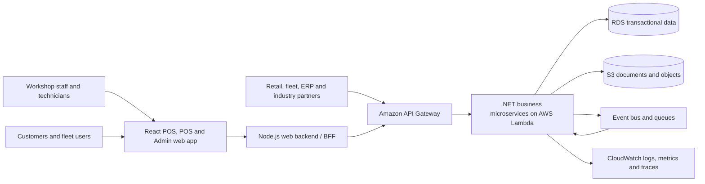

# Platform Architecture

## Purpose

Avayler is a vehicle workshop management platform. It provides the operational capabilities for workshop staff, technicians, administrators, customers, and business partners. Multi-tenant operation across customers is a future aspiration; today, each customer and environment is deployed into a separate AWS account.

## Current deployment model

The platform is deployed as an isolated customer-and-environment instance. A customer may therefore have separate AWS accounts for development, test, staging, and production, while another customer has its own corresponding accounts.

This account-per-customer-and-environment model follows AWS isolation best practices. It reduces the blast radius of a security breach, limits the impact of an operational failure, supports independent access and change control, and prevents one customer's workload from sharing the same account boundary as another customer's workload.

The application may use tenant-aware concepts internally where they support future evolution, but those concepts must not be presented as evidence that shared multi-tenant hosting is currently available.

## System context

## Logical layers

| Layer | Responsibility | Target technology |
| --- | --- | --- |
| Experience | Point-of-sale, point-of-service, administration, workshop and customer workflows | React, hosted static assets, Node.js BFF where aggregation or server-side policy is required |
| API | Authentication, routing, throttling, versioning, request validation | Amazon API Gateway and Lambda authorizers |
| Application | Business use cases and orchestration | Small .NET services and Lambda handlers |
| Domain | Rules and invariants for a business capability | .NET domain model owned by each service |
| Integration | Partner adapters, event publishing, retries, idempotency | Lambda, queues, event bus, SFTP/HTTP adapters |
| Data | Service-owned persistence and object storage | Amazon RDS, S3, and purpose-specific AWS managed services |

## Service boundary principles

- A service owns one business capability and its data model.
- Services communicate through versioned APIs or events, never by reading another service's tables.
- Each service is independently deployable and observable.
- Synchronous calls are reserved for data required to complete the current interaction.
- Events are used for propagation, integration, and workflows that can complete asynchronously.
- Shared libraries contain technical concerns only. Business rules remain in the owning service.

## Primary services

The following capabilities are the initial logical service map. The physical deployment may combine or split services only through an explicit architecture decision.

| Capability | Owns | Typical consumers |
| --- | --- | --- |
| Customer | customer identity, contact details, consent and relationships | POS, orders, CRM integrations |
| Vehicle | vehicle identity, registration, VIN and fitment references | POS, orders, parts and service workflows |
| Location | workshop and operating location configuration | scheduling, POS, administration |
| User and Access | users, roles, permissions and customer-instance membership | all authenticated channels |
| Catalog and Pricing | parts, services, price books, discounts and tax inputs | orders, POS, B2B |
| Order | active commercial transaction and order snapshot | POS, workshop, payment, invoice |
| Job and Workshop | work order, inspection, tasks, status and technician execution | scheduling, technician experience |
| Scheduling | capacity, availability, appointments and allocation | POS, web booking, workshop |
| Payment | payment intents, authorisations, refunds and reconciliation references | orders, invoice, finance integrations |
| Invoice | issued invoices, adjustments and settlement status | order, payment, ERP |
| Procurement | purchase orders, suppliers and receiving references | catalog, workshop, ERP |
| Integration | partner contracts, mappings, delivery state and replay operations | all integration-producing services |

## Request and event flow

A normal POS interaction follows: browser -> Node.js BFF -> API Gateway -> owning .NET Lambda -> service-owned persistence. A cross-service change publishes an event after the owning transaction is committed. Consumers process the event idempotently and record their processing position or outcome.

## Non-goals

This document does not prescribe a specific RDS engine, AWS region, VPC layout, CI/CD product, or detailed account vending process. The current account-per-customer-and-environment topology is an intentional isolation control and must be captured, automated, and governed in infrastructure documentation.
