# Operational Processes

## Workshop lifecycle

```mermaid
flowchart LR
    Enquiry[Enquiry or booking] --> CheckIn[Customer and vehicle check-in]
    CheckIn --> Order[Create order snapshot]
    Order --> Schedule[Schedule job and resources]
    Schedule --> Work[Inspect and perform work]
    Work --> Amend[Approve parts, pricing and changes]
    Amend --> Pay[Take payment]
    Pay --> Invoice[Issue invoice and close order]
    Invoice --> FollowUp[Publish notifications and partner updates]
```

## Process ownership

| Stage | Primary owner | Important outcome |
| --- | --- | --- |
| Enquiry and booking | Customer, Vehicle, Scheduling | Valid customer/vehicle context and appointment |
| Check-in | Order | Transaction snapshot created |
| Scheduling | Scheduling | Capacity and resource allocation confirmed |
| Workshop execution | Job and Workshop | Tasks, inspections, evidence, and completion state |
| Commercial changes | Order and Catalog/Pricing | Approved lines, discounts, tax, and totals |
| Settlement | Payment and Invoice | Authorised payment and issued financial record |
| Follow-up | Integration and Communication | Notifications, ERP/CRM/fleet updates, and audit status |

## Failure handling

An order must show an explicit state when a downstream operation is pending or failed. Operators need a safe retry or compensation action for payment, invoice, notification, and partner delivery failures. A failed integration must not silently roll back completed workshop work.

Detailed scheduling and work-order research is retained in [Scheduling Processes](Scheduling%20Processes.md), [Work Order Processing](Work%20Order%20Processing.md), and [Static Scheduling Research](../Static%20Scheduling%20Research.md). These pages should be migrated into this process model as their decisions are confirmed.
