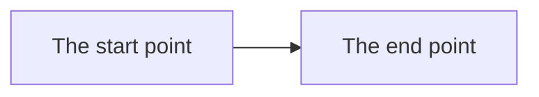
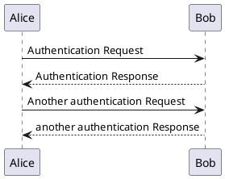

# Avayler Platform Documentation - Architecture

Platform documentation repository.  Diagrams are supplied in raw as either [Draw.IO (SVG)](https://www.drawio.com/), [Mermaid](https://mermaid.js.org/) or [PlantUML](https://plantuml.com/).  Modelling is done using the [C4 Model](https://c4model.com/).

[Global Glossary, Terms and Ubiquitous Language](Glossary-Ubiquitous-Language.md)

### Architecture

What are we aiming for? We should minimize the cost of implementation / maintenance and evolution while maximising the business value delivered (… ROI)

- What to think about:
- Focus on the essential business processes / needs 
- Only build for what is required today, let further complexity emerge [ KISS / YAGNI ]
- Maintainability is built-in, as business system may expect 8-10 years of life and evolution, be nice to the people who follow you (we will spend more time maintaining it than building it if history is correct)
- The answer is almost always it depends! The first to tell me why gets to pick topic #1 
- Everything should be expressed or documented in plain non-technical language wherever possible; otherwise we are discussing an implementation detail and not a business space problem 
- Everyone should contribute to and feel comfortable with questioning the documentation 
- Finally a good quote:
> The first concern of an architect is to make sure that the house is usable, not that the house is made of brick - Uncle Bob

### Characteristics of bad architecture

- Complex - Accidental or un-necessary complexity rather than necessary 
- Incoherent - Systems components or parts at any layer do not obviously fit 
- Rigid - Hard to change without major engineering - Low Coherence and Tight Coupling 
- Brittle - Changing one component part / method may break other parts of the system elsewhere without intention or un-noticed 
- Untestable - Unit or Integration testing is hard or impossible

All of the above lead to a maintainability cost which is unacceptable in terms of business value and cost to adapt.

### Characteristics of good architecture

- Simple - Only as complex as required given the problem at hand (KISS)
- Understandable - Easy to reason / understand the whole from the sum of it’s parts 
- Flexible - Easy to adapt to changing requirements 
- Emergent - Evolves over the lifetime of the project 
- Testable - Testing is a first class concern

All of the above should allow the flexibility to adapt the system over it’s lifetime at an acceptable cost to the business.

### Magnificent 7 Principles for Agile Delivery:
1. Autonomous Teams 
2. Collaboration 
3. Vertical Slicing 
4. Change Management 
5. Short Delivery Cycles 
6. Stakeholder Feedback 
7. Monitor-Control Loop

### Mermaid

### PlantUML

### Draw.IO Usage

[filename](/example.drawio ':include :type=code')

### LaTeX

Boxed Equation

$$
E=mc^2
$$

Inlilne = $ E=mc^2 $
